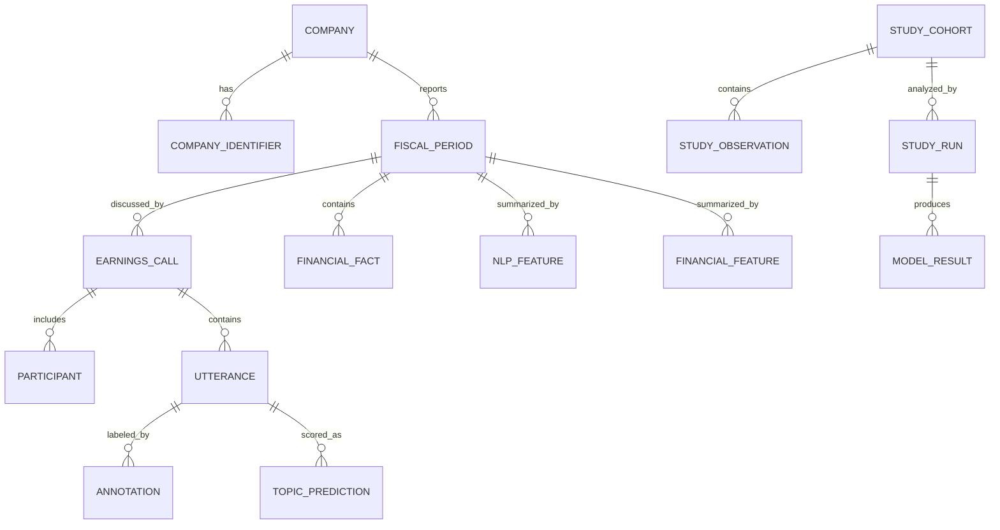
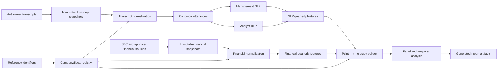

# Corporate Narrative vs. Business Reality — Project Design

> **Document type:** Product, research, data, and technical design  
> **Companion execution document:** [`PROJECT_PLAN.md`](PROJECT_PLAN.md)  
> **Status:** Proposed baseline  
> **Version:** 0.2.0  
> **Last updated:** 2026-09-05  
> **Owner:** Project lead

---

## 1. Purpose and boundary

This file defines **what the project is and how it is designed**: its research framing, scope, domain model, architecture, module boundaries, data contracts, methodology, technology choices, and design rationale.

It contains no delivery schedule, work breakdown, task ownership, milestones, or status tracking. Those belong exclusively in `PROJECT_PLAN.md`.

If artifacts disagree, authority is: approved ADR for the decision, this design, the project plan, versioned schemas/configurations, issues and pull requests, then notebooks and informal notes.

### 1.1 Design principles

- Design first, but keep replaceable internals.
- Define stable data and module boundaries before scaling.
- Put business mechanisms ahead of model sophistication.
- Prevent temporal leakage through the data model.
- Establish transparent baselines before complex models.
- Prefer open formats and established tools.
- Use a modular batch monolith until measured needs justify services.
- Treat null and failed robustness results as valid evidence.
- Default to local, single-node execution with bounded resource use. Cloud deployment, external API
  use, or a materially heavier compute profile requires explicit project-owner approval.

---

## 2. Product and research definition

### 2.1 Name and thesis

**Corporate Narrative vs. Business Reality**  
*An NLP and Panel-Data Study of Consumer Staples Earnings Calls*

The thesis is to convert changes in what Consumer Staples companies say into structured narrative signals, then test whether subsequent changes in business fundamentals move in the associated direction.

### 2.2 Core research question

> To what extent do within-company changes in corporate narrative during earnings calls contain information about subsequent changes in underlying business performance?

### 2.3 Product outputs

1. A reusable earnings-call NLP signal engine.
2. A governed company-quarter analytical dataset joining narrative and financial features.
3. An evidence-backed empirical analysis and research report.

### 2.4 Initial scope

- Consumer Staples only.
- Start from a point-in-time snapshot of S&P 500 constituents classified as GICS Consumer
  Staples, then select approximately 15–30 companies using predeclared coverage and quality rules.
- Preferably 12–20+ usable quarterly calls per company.
- Use an explicitly documented unbalanced-panel or revised-window rule because observed STRUX
  endpoints are uneven; do not imply uniform 2017–2024 coverage.
- STRUX as a restricted, local-only transcript source for this personal portfolio project. Its
  absent license remains a recorded risk: never publish raw/reconstructable text or send it to an
  external model/API; publish code, provenance, and non-reconstructable aggregate results only.
- Company × fiscal quarter as the canonical observation.
- Management prepared remarks, management answers, and analyst questions separated.
- Roughly 10–15 economically meaningful topics.
- Topic intensity, topic change, semantic shift, and uncertainty.
- Core financial outcomes and a small number of defensible operating metrics.
- Lagged panel analysis emphasizing within-company changes.

### 2.5 Non-goals

- Stock prediction, trading strategy, or investment advice.
- Causal claims without a separate identification strategy.
- RAG, chatbots, or autonomous agents.
- Multi-industry or general SEC coverage in v1.
- Real-time ingestion or serving.
- Public transcript warehouse or SaaS product.
- A 50–100-topic ontology.
- Management honesty, deception, or intent scoring.
- Unversioned LLM calls as a production measurement method.

“Narrative vs. reality” means timing, alignment, emphasis, and predictive association. It is not an allegation of misconduct.

---

## 3. Research design

### 3.1 Observation and identity

The canonical key is:

```text
(company_id, fiscal_year, fiscal_quarter)
```

`company_id` is immutable and internal. CIK, ticker, legal name, LEI, industry code, and provider identifiers are effective-dated attributes. Ticker is never a primary key.

### 3.2 Time model

The model distinguishes `fiscal_period_start`, `fiscal_period_end`, `earnings_release_at`, `call_started_at`, `transcript_available_at`, `filing_accepted_at`, and `retrieved_at`.

The narrative signal timestamp defaults to `call_started_at`. Fiscal, call, filing, and calendar quarters are never assumed identical. Information availability, not merely reported period, determines predictor eligibility.

### 3.3 Research questions

| ID | Question | Role |
|---|---|---|
| RQ1 | Do management topic changes precede corresponding fundamental changes? | Primary family |
| RQ2 | Does semantic narrative shift precede large business changes or volatility? | Secondary |
| RQ3 | Does uncertainty precede forecast error, volatility, or guidance change? | Secondary |
| RQ4 | Do realized business changes precede later narrative changes? | Reverse-timing diagnostic |
| RQ5 | Does management–analyst divergence correspond to later outcomes? | Extension |

### 3.4 Mechanism map

| Narrative at *t* | Candidate primary outcome | Other outcomes | Horizon |
|---|---|---|---|
| Pricing | Price/mix or organic price growth | Revenue, volume, gross margin | t+1; t+2 exploratory |
| Demand / volume | Organic volume | Revenue, inventory | t+1 |
| Cost pressure | Gross-margin change | COGS ratio, operating margin | t+1 |
| Expansion | International revenue growth | CapEx, distribution/store metrics | t+1 to t+2 |
| Innovation | R&D or launch metric | Revenue/volume | t+1 to t+2 |
| Supply chain | Inventory/working capital | Gross margin | t+1 |
| Uncertainty | Outcome volatility or forecast error | Guidance revision | t+1 |

Only mechanisms with adequate, comparable outcome coverage may become confirmatory.

### 3.5 Within-company and temporal design

The core measurement is deviation from the same company's history:

\[
X'_{i,t}=X_{i,t}-\bar X_i
\]

The principal direction is:

\[
Narrative_{i,t}\rightarrow Outcome_{i,t+1}
\]

Contemporaneous relationships are descriptive because calls discuss the reported quarter. Reverse-direction and placebo-lead models diagnose reaction and timing artifacts.

### 3.6 Primary model family

\[
Y_{i,t+h}=\beta X_{i,t}+\gamma Y_{i,t}+\alpha_i+\delta_t+\theta C_{i,t}+\epsilon_{i,t}
\]

Here \(\alpha_i\) is a company effect, \(\delta_t\) a common time effect, and \(C_{i,t}\) prespecified controls. The default horizon is one quarter. Standard errors are clustered by company, with small-cluster alternatives evaluated because the company count is modest.

### 3.7 Robustness and multiplicity

The design progresses through narrative levels, changes, within-company scores, lagged outcome controls, company/time effects, prespecified controls, alternative feature/lag definitions, leave-one-company-out influence, and placebo/reverse-timing tests.

One primary pair is chosen from literature and coverage before confirmatory outcomes are examined. All post-freeze specifications are registered. Secondary families report raw and false-discovery-rate-adjusted values. Confirmatory, robustness, and exploratory findings remain distinct.

---

## 4. Domain model



| Entity | Responsibility |
|---|---|
| Company / identifier | Stable identity and effective external mappings |
| Fiscal period | Canonical reporting-period time spine |
| Earnings call | Event timing, reported period, and source provenance |
| Participant / utterance | Role-aware ordered text corpus |
| Annotation | Human label and adjudication lineage |
| Topic prediction | Chunk/topic/model-version output |
| Financial fact | Source fact and filing/restatement lineage |
| NLP/financial feature | Versioned company-quarter measurement |
| Study cohort/run/result | Frozen selection, specification, and empirical outputs |

Missingness uses typed reasons: `not_reported`, `not_applicable`, `source_missing`, `parse_failed`, `mapping_unresolved`, `quality_rejected`, and `not_yet_available`. Zero is never used as a missing-data substitute.

---

## 5. System architecture

### 5.1 Style and flow

The system is a **local-first modular monolith executed as a batch DAG**. Modules share typed interfaces and versioned Parquet contracts.



### 5.2 Data layers

| Layer | Purpose | Mutability | Format |
|---|---|---|---|
| Raw | Authorized source snapshots/manifests | Append-only | Source format + manifest |
| Interim | Parsed, not canonical | Rebuildable | Parquet |
| Curated | Validated domain tables | Rebuildable/versioned | Parquet |
| Features | NLP and financial measurements | Rebuildable/versioned | Parquet |
| Analytical | Frozen point-in-time studies | Immutable per version | Parquet |
| Reports | Derived tables, figures, manuscript | Rebuildable | CSV/PNG/SVG/HTML/PDF |

### 5.3 Module boundaries

- **Registry:** company identity, industry eligibility, fiscal periods, call-quarter mapping, inclusion reasons.
- **Transcript ingestion:** authorized discovery/materialization and raw provenance only.
- **Transcript normalization:** encoding, participants, roles, sections, ordering, chunking, duplicate and quality flags.
- **Taxonomy/annotation:** topic semantics, codebooks, annotations, adjudication, compatibility.
- **NLP:** dictionary/classifier/embedding inference, uncertainty, prediction metadata.
- **Financial ingestion:** SEC/provider acquisition, caching, filing/amendment provenance.
- **Financial normalization:** period resolution, canonical mappings, restatements, derived metrics, reconciliation.
- **Features:** company-quarter aggregation, lags, deltas, baselines, temporal eligibility.
- **Analysis:** frozen cohort, registered specifications, tidy estimates, diagnostics.
- **Reporting:** rendering from formal outputs with no hidden transformations.

### 5.4 Replaceability

- Transcript and financial sources are adapters.
- Multiple topic scorers use one prediction contract.
- Model selection is configuration-driven with immutable revisions.
- DVC invokes normal Python CLI commands; domain logic does not import DVC.
- MLflow records runs; analysis correctness does not require its server.
- Local and object storage share logical artifact references.

The initial universe adapter consumes the openly licensed Data Package maintained at
`datasets/s-and-p-500-companies`, filters the exact `Consumer Staples` GICS sector label, and
normalizes CIKs to ten digits. Every run records the upstream revision, retrieval date, license,
raw SHA-256, configuration SHA-256, and row-level fingerprints. The output is a current-membership
snapshot, not historical index membership. Any historical-membership design requires a separate
licensed source and ADR because it changes selection-bias properties.

Representative interfaces:

```python
class TranscriptSource(Protocol):
    def discover(self, registry, config) -> Iterable[SourceRecord]: ...
    def materialize(self, record, destination) -> RawArtifact: ...


class FinancialSource(Protocol):
    def fetch_company(self, company_ref, as_of, destination) -> RawArtifact: ...


class TopicScorer(Protocol):
    def score(self, chunks, model_spec) -> TopicPredictionTable: ...
```

---

## 6. Data contracts

### 6.1 Dataset inventory

| Dataset | Grain | Key |
|---|---|---|
| `company_registry` | Identifier/effective interval | company, identifier type, validity |
| `fiscal_periods` | Company fiscal quarter | canonical observation key |
| `calls` | Earnings call | `call_id` |
| `participants` | Participant per call | `call_id`, `participant_id` |
| `utterances` | Ordered call chunk | `call_id`, `utterance_id` |
| `annotations` | Unit × label × annotator | `annotation_id` |
| `topic_predictions` | Chunk × topic × method | versioned prediction key |
| `nlp_features` | Quarter × feature × method | observation + feature identity |
| `financial_facts` | Source fact/version | `fact_id` |
| `financial_features` | Quarter × metric | observation + metric identity |
| `study_cohort` | Quarter × cohort version | observation + version |
| `model_results` | Run × specification × term | `run_id`, `spec_id`, `term` |

Long-form feature tables are canonical; wide matrices are study-specific derivatives.

### 6.2 Common provenance

Curated data records source system/record/locator/revision, retrieval time, pipeline run, code commit, schema version, resolved configuration hash, input content hash, creation time, and quality status. Model-derived rows also store method/model/taxonomy revisions and seed.

### 6.3 Utterance contract

```text
call_id, utterance_id, sequence_no
company_id, fiscal_year, fiscal_quarter
call_started_at
section: prepared_remarks | qa | unknown
speaker_name_raw, speaker_name_normalized
speaker_role: executive | company_other | analyst | operator | unknown
speaker_organization
text, token_count, language
is_duplicate, quality_flags
```

Sequence is unique and ordered. Unknown roles remain visible. Original authorized text is recoverable from raw storage. A call cannot silently map to multiple fiscal quarters.

### 6.4 Financial fact contract

```text
fact_id, company_id
concept_raw, concept_canonical
unit, value
period_start, period_end
fiscal_year, fiscal_quarter
form, filed_at, accession_number, is_amendment
source, mapping_version, quality_flags
```

Source facts are preserved; canonicalization is additive. Quarter derivation from year-to-date data requires explicit duration rules. Restatements remain traceable. Ratios retain numerator and denominator lineage.

### 6.5 Contract evolution

Additive nullable fields normally increment a minor schema version. Key, meaning, unit, or null-semantics changes require a major version and migration ADR. Formal study datasets bind schema and content hashes.

---

## 7. NLP design

### 7.1 Text views and taxonomy

Separate views exist for management prepared remarks, management answers, combined management speech, and analyst questions. Operator/company-other/unknown text is retained for audit and excluded by default.

Candidate topics:

1. Demand / consumption
2. Volume / traffic
3. Pricing / price-mix
4. Premiumization / mix
5. Cost pressure / inflation
6. Supply chain / inventory / logistics
7. Expansion / distribution / international
8. Product / innovation
9. Marketing / brand investment
10. Digital / e-commerce / direct-to-consumer
11. Competition / private label
12. Guidance / outlook
13. Other / none

Each taxonomy version defines stable IDs, economic meaning, inclusion/exclusion rules, positive/hard-negative/boundary examples, allowed co-labels, outcome mapping, and version compatibility.

### 7.2 Annotation

Sampling is stratified by company, time, section, role, length, and candidate topic. A pilot precedes scale. A meaningful overlap is double-annotated, disagreements are analyzed per label, and a locked test set is adjudicated. Label Studio is the interface; versioned export with annotator/codebook lineage is canonical.

### 7.3 Model ladder

1. Dictionary baseline with phrase, negation, and section rules.
2. TF-IDF word/character features with one-vs-rest linear classifier.
3. Versioned sentence embeddings plus linear classifier/prototype diagnostic.
4. Fine-tuned Hugging Face/PyTorch transformer only if earlier error analysis justifies it.

Human-adjudicated labels remain ground truth. External LLM processing requires explicit license/privacy approval.

### 7.4 Feature definitions

Topic intensity:

\[
TopicIntensity_{i,t,k}=\frac{\sum_j w_jp(y_k\mid chunk_j)}{\sum_jw_j}
\]

The default weight is token count with a cap. Hard-label share and mention rate are robustness variants.

Topic change:

\[
\Delta Topic_{i,t,k}=TopicIntensity_{i,t,k}-TopicIntensity_{i,t-1,k}
\]

Missing preceding quarters do not become one-quarter changes. First observations are null; longer gaps carry explicit gap length.

Semantic shift:

\[
Shift_{i,t}=1-\cos(E_{i,t},E_{i,t-1})
\]

Comparisons use identical speaker/section eligibility and immutable embedding revision.

Uncertainty begins with an established finance-language dictionary and contextual validation. It remains distinct from negativity, hedging, risk, and forward-looking language.

Analyst attention is the topic-weight share of eligible analyst questions. Management–analyst divergence defaults to Jensen–Shannon divergence with declared smoothing/log base, accompanied by signed per-topic gaps.

### 7.5 Evaluation

- Time-respecting, near-duplicate-aware splits.
- Locked human-adjudicated test set.
- Macro/micro and per-label precision, recall, F1, and support.
- Calibration where probabilities drive features.
- Slices by company, section, time, length, and quality status.
- Comparison with prevalence, dictionary, and linear baselines.
- Quarterly feature stability and face validity, not only chunk metrics.

---

## 8. Financial and analytical design

### 8.1 Source hierarchy

1. SEC EDGAR submissions and Company Facts/XBRL.
2. Company filings and investor-relations material for verification/operating metrics.
3. Approved licensed financial source for normalization/cross-checking.
4. Governed manual extraction for narrowly selected metrics.

Sources never blend opaquely; each fact retains provider and source locator.

### 8.2 Normalization

```text
raw fact -> validate source/unit/duration -> company mapping
 -> canonical metric -> fiscal-quarter assignment
 -> point-in-time version -> derived feature -> reconciliation/quality flag
```

Mappings are versioned configuration/data, not scattered conditionals.

### 8.3 Feature tiers

- **Tier A:** revenue/growth, gross profit/margin, operating income/margin, EPS, inventory/growth, operating cash flow, CapEx.
- **Tier B:** SG&A/ratio, R&D where comparable, declared free-cash-flow formula, working capital.
- **Tier C:** organic growth, price/mix, volume, geography/segments, distribution/stores/customers/e-commerce.

Tier C promotion requires stable definitions, adequate coverage, source traceability, and independent checking. Incompatible company definitions are not pooled silently.

### 8.4 Point-in-time views

`as_reported` is the value available at a historical cutoff. `latest_restated` is the latest accepted value used for reconciliation or declared sensitivity analysis. Predictors use point-in-time inputs. Outcome view is explicit in the study configuration.

### 8.5 Study builder and leakage

The builder joins registry, narrative features, financial outcomes, quality indicators, and controls using declared cardinalities. It emits included rows and typed exclusions.

Invariants:

- No predictor source becomes available after the signal cutoff.
- Outcome horizon follows the declared reporting/call time model.
- Future rows cannot change past-only features.
- Imputation/preprocessing fits only on eligible training/past data.
- Duplicate text cannot cross evaluation boundaries unnoticed.
- Cohort, feature versions, missingness policy, config, code, environment, and hashes freeze together.

---

## 9. Technology design

Exact versions live in `uv.lock`, not this document. Model registries use immutable revisions.

| Concern | Choice | Rationale |
|---|---|---|
| Runtime | Python 3.12+ after compatibility check | Strong shared NLP, statistical, and data ecosystem |
| Environment | uv, `pyproject.toml`, committed `uv.lock` | Fast portable setup and exact tested resolution |
| Transformations | Polars | Typed lazy expressions and efficient Parquet path |
| Analytical SQL | DuckDB | Embedded SQL over Parquet without a server |
| Durable data | Parquet/Zstandard | Open, efficient, interoperable columnar format |
| Contracts/config | Pandera + Pydantic Settings + YAML | Standard validation, typed settings, readable studies |
| Pipeline | DVC invoking Python CLI | File DAG and large-artifact lineage without Git data |
| Experiments | MLflow, local first | Standard run/dataset/model/artifact history; shared upgrade path |
| NLP | scikit-learn, Sentence Transformers, Hugging Face, PyTorch | Strong baselines and mainstream models |
| Statistics | statsmodels + linearmodels | Transparent statistical and panel estimators |
| Annotation | Label Studio | Established review UI with exportable data |
| Quality | pytest, Hypothesis, Ruff, Pyright | Common tests, properties, formatting/linting, types |
| Security/CI/docs | detect-secrets, pip-audit, Dependabot, GitHub Actions, MkDocs | Standard controls and versioned automation/docs |

Polars owns production transformations. DuckDB owns SQL inspection/reconciliation and selected analytical joins. The same production transformation is not implemented twice.

Deferred until measured triggers: workflow orchestrator, Spark, PostgreSQL warehouse, feature-store service, FastAPI, React/Next.js dashboard, Kubernetes, and dbt. Each solves a problem not present in the baseline research system.

---

## 10. Repository structure

```text
corporate-narrative-vs-business-reality/
├── .github/workflows/
├── configs/{data,features,models,studies}/
├── data/{raw,interim,curated,features,analytical}/
├── docs/{adr,data-contracts,methodology,model-cards,runbooks}/
├── notebooks/{exploration,publication}/
├── reports/{figures,tables,manuscript}/
├── scripts/
├── src/cnbr/
│   ├── registry/
│   ├── ingestion/{transcripts,financials}/
│   ├── transcripts/
│   ├── taxonomy/
│   ├── nlp/
│   ├── financials/
│   ├── features/
│   ├── analysis/
│   ├── reporting/
│   ├── contracts/
│   └── cli.py
├── tests/{unit,integration,contract,regression,fixtures}/
├── dvc.yaml
├── mkdocs.yml
├── pyproject.toml
├── uv.lock
├── PROJECT_DESIGN.md
├── PROJECT_PLAN.md
└── README.md
```

Production logic lives in `src/cnbr`; notebooks import it. CLI commands are stable pipeline interfaces. Generated results are never hand-edited. Tests use synthetic or legally redistributable fixtures. Each output path has one owner.

Proposed CLI:

```text
cnbr registry build
cnbr transcripts ingest|normalize
cnbr taxonomy validate
cnbr annotations export
cnbr nlp featurize
cnbr financials ingest|normalize
cnbr features build-study
cnbr analysis describe|fit|robustness
cnbr report build
cnbr validate all
```

---

## 11. Quality, security, and reproducibility

### 11.1 Quality attributes

- **Reproducible:** run ID, command, code/dirty state, lock/config/input/output hashes, revisions, seeds, counts, and validation summary.
- **Modular:** contract-based modules, narrow provider/model interfaces, open storage formats.
- **Auditable:** result → specification → study row → feature/fact → authorized source.
- **Reliable:** boundary validation, partial-failure manifests, bounded retry, immutable cache, resumable stages.
- **Observable:** structured counts/timings/quality metadata without transcript text in logs.
- **Portable:** Windows development and Linux CI; cloud promotion through configuration/adapters.

### 11.2 Data classification and controls

| Class | Examples | Git/release rule |
|---|---|---|
| Public metadata | CIK, filing links, schemas | Allowed |
| Licensed/restricted | Transcript text, vendor facts | Never ordinary Git; release per license |
| Derived-sensitive | Reconstructable chunk predictions | Review required |
| Release-safe | Approved aggregate results | Allowed after review |
| Secrets | Credentials/tokens | Never Git or release |

Controls include source-rights records, least-privilege credentials, secret/dependency scanning, path/archive validation, pinned model revisions, disabled arbitrary remote code, restricted-text-free logs, and a deletion/rebuild process for revoked rights.

### 11.3 Ethical presentation

Do not rank truthfulness or infer intent. Present NLP as imperfect measurement. Report selection, survivorship, disclosure, and comparability limits. Preserve context around company-specific metrics.

---

## 12. Design decision register

| ID | Decision | Status | Rationale | Revisit trigger |
|---|---|---|---|---|
| D-001 | Company × fiscal quarter grain | Accepted | Aligns calls, reporting, and panel analysis | Research unit changes |
| D-002 | Consumer Staples only | Accepted | Reduces heterogeneity | Cohort infeasible or v1 complete |
| D-003 | Within-company change + lagged outcomes | Accepted | Controls style and contemporaneous reporting | Method evidence invalidates it |
| D-004 | Modular batch monolith | Accepted | Fits scale with low operational cost | Scheduling/concurrency need |
| D-005 | Parquet boundary | Accepted | Open and interoperable | Required semantics do not fit |
| D-006 | Python + uv | Proposed | Mainstream ecosystem and locked portability | Compatibility fails |
| D-007 | Polars primary; DuckDB verification | Proposed | Complementary roles on common format | Benchmark/team evidence differs |
| D-008 | DVC lineage, optional and cache-isolated | Accepted with mitigation | Research DAG and artifact versioning; keep untrusted writers away from cache | Patched dependency, security posture change, or safer equivalent |
| D-009 | MLflow tracking | Proposed | Standard experiment lineage | Cost exceeds benefit |
| D-010 | STRUX restricted local source for owner-accepted personal use | Accepted with constraints | Structured roles, modest size, and portfolio value; no license is asserted | Quality/coverage fails, intended use expands, or redistribution becomes necessary |
| D-011 | SEC XBRL primary financial source | Proposed | Primary-source provenance | Outcome coverage fails |
| D-012 | Baselines before complexity | Accepted | Proves incremental value | Not expected |
| D-013 | No dashboard in core v1 | Accepted | Research system/report are primary | User evidence establishes need |
| D-014 | No causal language | Accepted | Observational design | Identification design approved |
| D-015 | Point-in-time S&P 500 GICS Consumer Staples universe from the ODC-PDDL Data Package | Accepted | Reproducible, openly licensed, supplies CIK and standard sector labels | Historical-membership source becomes necessary or source/license changes |
| D-016 | Local-first resource envelope and approval gate | Accepted | Keeps the project viable on ordinary hardware and prevents unapproved external processing/cost | Owner approves a measured exception |
| D-017 | Three-worker, 8-request/second SEC acquisition with file manifests | Accepted | Reliable and resumable at 34-company scale without a metadata database | Scale or multi-process coordination invalidates file-level checkpointing |
| D-018 | Pin and checksum the two non-overlapping STRUX `full` shards, then filter locally | Accepted | Reproducible acquisition without double-counting train/test views | Upstream revision/schema changes or a licensed replacement is selected |
| D-019 | Coverage-qualified 28-company unbalanced candidate panel with a 12-company recent-coverage robustness cohort | Accepted | Preserves clusters and within-firm history while exposing temporal source gaps | Fewer than 15 firms retain 12 mapped calls or supplemental coverage changes the evidence |

Full ADRs record context, drivers, alternatives, decision, consequences, validation, and rollback.

---

## 13. Open design questions

- Long-term STRUX replacement or explicit licensing if project use expands beyond private portfolio analysis.
- Final fiscal/content-qualified membership within the predeclared coverage cohorts.
- Primary mechanism after coverage-only review.
- Cross-company SEC gross-margin and CapEx comparability.
- Price/mix and organic-growth coverage.
- Multi-label constraints and final taxonomy boundaries.
- Embedding/model choice after benchmark.
- Pilot-supported agreement, model, role, and coverage thresholds.
- DVC Windows/team ergonomics.
- Local versus shared MLflow setup.

These remain design variables until evidence and an ADR resolve them.

---

## Appendix — Official technology references

- uv: <https://docs.astral.sh/uv/guides/projects/>
- Polars lazy API: <https://docs.pola.rs/user-guide/concepts/lazy-api/>
- DuckDB Parquet: <https://duckdb.org/docs/stable/data/parquet/overview>
- DVC pipelines: <https://dvc.org/doc/user-guide/pipelines>
- MLflow tracking: <https://mlflow.org/docs/latest/ml/tracking/>
- SEC EDGAR APIs: <https://www.sec.gov/search-filings/edgar-application-programming-interfaces>
- Hugging Face Transformers: <https://huggingface.co/docs/transformers/>
- Pandera: <https://pandera.readthedocs.io/>
- Label Studio: <https://labelstud.io/guide/>
- linearmodels panel models: <https://bashtage.github.io/linearmodels/panel/>
