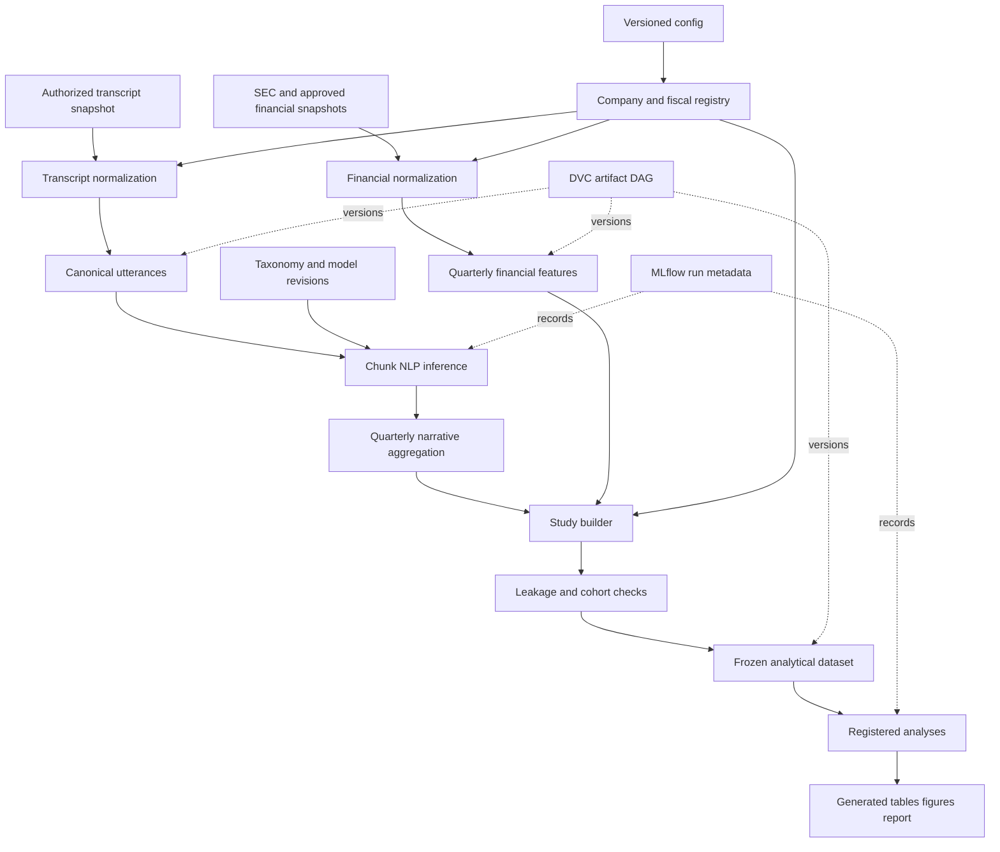

# Corporate Narrative vs. Business Reality — Project Plan

> **Document type:** Implementation and delivery plan  
> **Design specification:** [`PROJECT_DESIGN.md`](PROJECT_DESIGN.md)  
> **Status:** Proposed for execution  
> **Version:** 0.1.0  
> **Last updated:** 2026-09-05  
> **Planning horizon:** Research release v1  
> **Default delivery model:** One primary implementer with part-time domain and independent review

---

## 1. Purpose and authority

This document defines **how the approved project design will be executed**. It owns requirements, deliverables, sequencing, controls, evidence needed at decision points, and definitions of completion. It does not own the product definition, research design, domain structure, or architecture; those live in `PROJECT_DESIGN.md`. It is detailed enough to drive issues and pull requests while remaining modular enough to change after discovery.

### 1.1 Source-of-truth hierarchy

When artifacts disagree, use this order:

1. Approved Architecture Decision Record (ADR) for the specific decision.
2. `PROJECT_DESIGN.md` for product, research, structure, and architecture intent.
3. This project plan for execution and acceptance.
4. Versioned data contracts and study configurations.
5. Milestone and issue trackers.
6. Notebooks, presentations, and informal notes.

No issue, notebook, or implementation shortcut may silently override a higher-level artifact.

### 1.2 What is fixed and what is adaptable

**Fixed until changed by ADR:**

- Consumer Staples is the initial industry.
- Company × fiscal quarter is the canonical analytical grain.
- Main inference uses within-company narrative changes and future outcomes.
- Association, not causality, is the v1 claim boundary.
- The system is a reproducible batch research pipeline, not an online application.
- Raw licensed data is not committed to Git.

**Expected to change after evidence:**

- Final company universe.
- Primary narrative–outcome mechanism.
- Topic boundaries and retained labels.
- Exact transcript and supplementary financial providers.
- Model architecture and embedding model.
- Quality thresholds after pilot measurement.
- Whether analyst divergence and Tier C metrics fit v1.
- Local versus shared experiment/artifact infrastructure.

### 1.3 Execution principle

Build the thinnest trustworthy end-to-end slice before scaling any component. A pipeline that processes three companies correctly, with source-to-result lineage, is more valuable early than a partially correct corpus-wide model.

---

## 2. Delivery outcome

The v1 release is complete only when it contains all of the following:

1. A reproducible, authorized Consumer Staples transcript corpus.
2. A canonical company/fiscal-quarter registry.
3. Auditable standardized financial and operating features.
4. A versioned topic taxonomy and human-reviewed evaluation set.
5. Validated management narrative signals at company-quarter grain.
6. A leakage-safe analytical dataset with frozen cohort and lineage.
7. Preregistered primary and secondary empirical results.
8. Robustness, reverse-timing, missingness, and influence analysis.
9. A research report, dataset card, model cards, ADRs, and runbooks.
10. A clean-environment reproduction of all releasable outputs.

### 2.1 Release non-goals

The implementation must not add these merely because tooling makes them easy:

- Stock prediction or investment recommendations.
- Real-time services, APIs, or event streaming.
- RAG, chatbot, or autonomous-agent features.
- Multi-industry expansion.
- Public redistribution of restricted transcript text.
- Company “honesty,” deception, or intent scores.
- Causal conclusions unsupported by an identification strategy.
- A dashboard before the report and core pipeline are complete.

---

## 3. Planning assumptions and constraints

### 3.1 Assumptions

| ID | Assumption | Validation point | If false |
|---|---|---|---|
| A-01 | STRUX can be accessed and legally used for the intended transformations | M1 | No acquisition before explicit permission/license; switch transcript adapter/source if declined or unclear |
| A-02 | At least 15 companies have roughly 12 usable calls | M1 | Reduce inference scope, extend time, or reconsider industry only through ADR |
| A-03 | Speaker roles and call sections can be normalized reliably | M1/M2 | Exclude weak records, add manual mapping, or restrict signal sections |
| A-04 | SEC filings cover core GAAP outcomes | M1/M2 | Add licensed source or narrow outcomes |
| A-05 | One economically matched narrative/outcome pair has adequate coverage | M1 | Choose a different mechanism before looking at outcome associations |
| A-06 | Single-node compute is sufficient | M0/M4 benchmark | Add batch GPU or larger machine; do not introduce Spark by instinct |
| A-07 | Human annotation capacity is available | M3 | Reduce taxonomy/sample, extend schedule, or procure annotation review |
| A-08 | GitHub is acceptable for code/issues/CI | M0 | Replace collaboration layer without changing pipeline contracts |

### 3.2 Constraints

- Expected study size is approximately 180–600 company-quarter rows; statistical power and number of independent company clusters are limited.
- Transcript coverage may end in 2024 even when the implementation occurs later.
- Consumer Staples companies use non-uniform fiscal calendars and XBRL tags.
- Price/mix, organic growth, volume, and other operating metrics are not standardized GAAP concepts.
- Licensed transcript text may restrict sharing, external model APIs, or public fixtures.
- Main development environment must work on Windows and CI on Linux.
- Default execution must remain local and single-node. Ask the project owner before using any cloud
  service, making production/external API requests, purchasing compute, or adopting a step expected
  to exceed the resource envelope below.
- Default resource envelope: no required GPU, no more than 16 GB peak RAM, no more than 20 GB of
  project data/artifacts, and no unattended single job expected to exceed 30 minutes on an ordinary
  development machine. Benchmark first; seek approval for a measured exception rather than silently
  scaling infrastructure.

### 3.3 Schedule model

The base estimate is 14–22 focused weeks for one primary implementer. Ranges are recalculated after M1 using observed coverage and mapping/annotation effort. Dates are commitments only after resource capacity is assigned.

---

## 4. Requirements baseline

Priority uses MoSCoW:

- **Must:** required for a valid v1 release.
- **Should:** high value, included unless evidence or schedule forces a documented trade.
- **Could:** extension after Must requirements pass.
- **Won't v1:** explicitly excluded.

### 4.1 Business and product requirements

| ID | Requirement | Priority | Verification |
|---|---|---:|---|
| BR-01 | The project shall answer whether within-company narrative changes contain information about later business changes | Must | Final report maps result to preregistered specification |
| BR-02 | The project shall remain interpretable to NLP, data-science, accounting, and finance reviewers | Must | Review of report, contracts, and mechanism map |
| BR-03 | Null, contradictory, and unstable results shall be first-class outcomes | Must | All registered models appear in results appendix |
| BR-04 | A reviewer shall reproduce permitted outputs without undocumented intervention | Must | Clean-environment release rehearsal |
| BR-05 | Every headline result shall trace to source records, code, config, and run ID | Must | Sampled lineage audit |
| BR-06 | The project shall avoid causal, deception, or investment claims | Must | Claims review checklist |
| BR-07 | Analyst-attention divergence shall be added only after the management-signal core succeeds | Should | Gate sequencing evidence |
| BR-08 | A static or interactive explorer may be added only if report reviewers need it | Could | User need + ADR |

### 4.2 Functional requirements — registry and ingestion

| ID | Requirement | Priority | Acceptance evidence |
|---|---|---:|---|
| FR-REG-01 | Assign a stable internal `company_id`; never use ticker as primary key | Must | Contract and identifier-change tests |
| FR-REG-02 | Maintain effective-dated CIK, ticker, legal name, and source identifiers | Must | Registry audit sample |
| FR-REG-03 | Construct a canonical fiscal-quarter spine for every eligible company | Must | Continuity and uniqueness report |
| FR-REG-04 | Record company inclusion/exclusion rule and reason | Must | Cohort attrition artifact |
| FR-TR-01 | Import transcript source records without destructive modification | Must | Raw manifest and checksums where allowed |
| FR-TR-02 | Record source, revision, retrieval time, call time, and reported fiscal period | Must | Contract tests |
| FR-TR-03 | Normalize speaker, role, section, order, encoding, and text chunks | Must | Golden-record tests and manual audit |
| FR-TR-04 | Preserve unknown/ambiguous roles with quality flags | Must | No silent coercion test |
| FR-TR-05 | Detect duplicate calls and duplicate/near-duplicate utterances | Must | Duplicate report and reviewed exceptions |
| FR-FIN-01 | Retrieve and cache SEC filing/submission/XBRL facts under access rules | Must | Integration test and request log metadata |
| FR-FIN-02 | Preserve original facts and add canonical mappings non-destructively | Must | Source-to-canonical lineage sample |
| FR-FIN-03 | Resolve duration, instant, quarter, year-to-date, amendment, and restatement semantics | Must | Financial golden tests |
| FR-FIN-04 | Support provider adapters for supplemental licensed data | Should | Interface contract and one stub/test adapter |

### 4.3 Functional requirements — taxonomy and NLP

| ID | Requirement | Priority | Acceptance evidence |
|---|---|---:|---|
| FR-NLP-01 | Maintain versioned topic IDs, definitions, inclusions, exclusions, examples, and compatibility changes | Must | Taxonomy schema and codebook |
| FR-NLP-02 | Support multi-label chunk annotation if pilot evidence confirms co-occurrence | Must | Annotation ADR and schema |
| FR-NLP-03 | Maintain annotator and adjudication lineage | Must | Annotation export contract |
| FR-NLP-04 | Implement keyword and classical supervised baselines before transformer adoption | Must | Benchmark report |
| FR-NLP-05 | Produce chunk predictions with method/model/taxonomy/input versions | Must | Feature lineage tests |
| FR-NLP-06 | Aggregate management prepared remarks, management answers, and analyst questions separately | Must | Aggregation unit tests |
| FR-NLP-07 | Produce topic intensity, quarter change, and historical within-company normalization | Must | Formula/gap-policy tests |
| FR-NLP-08 | Produce semantic narrative shift using comparable sections and immutable embedding revision | Must | Stability and sensitivity report |
| FR-NLP-09 | Produce an independently validated uncertainty signal | Must | Construct evaluation artifact |
| FR-NLP-10 | Produce analyst attention and management–analyst divergence | Should | Feature validation and explanatory gaps |
| FR-NLP-11 | Support LLM-assisted candidate labeling only under license/privacy rules; human labels remain ground truth | Could | Approved ADR and audit log |

### 4.4 Functional requirements — features and analysis

| ID | Requirement | Priority | Acceptance evidence |
|---|---|---:|---|
| FR-AN-01 | Build one row per company/fiscal quarter in a frozen study cohort | Must | Key uniqueness test |
| FR-AN-02 | Join data with explicit availability timestamps and cardinality assertions | Must | Leakage and join tests |
| FR-AN-03 | Create lags/deltas without treating missing intervening quarters as consecutive | Must | Property tests |
| FR-AN-04 | Create expanding historical baselines using past information only | Must | Future-invariance test |
| FR-AN-05 | Run the declared panel specification and robustness ladder | Must | Complete specification registry |
| FR-AN-06 | Run reverse-timing, placebo, missingness, and influential-company checks | Must | Results bundle |
| FR-AN-07 | Apply multiple-testing control to secondary hypothesis families | Must | Results table with raw/adjusted values |
| FR-AN-08 | Separate confirmatory, robustness, and exploratory outputs | Must | Report structure and result metadata |
| FR-AN-09 | Generate figures and tables from code without manual value editing | Must | Rebuild/hash comparison |
| FR-AN-10 | Evaluate predictive increment against lagged-outcome/company/time baselines only as a diagnostic | Should | Temporal benchmark report |

### 4.5 Data requirements

| ID | Requirement | Priority | Verification |
|---|---|---:|---|
| DR-01 | Durable tables use Parquet with declared schemas and versions | Must | Contract suite |
| DR-02 | Raw inputs are immutable/append-only and segregated from rebuildable outputs | Must | Storage layout inspection |
| DR-03 | Every curated row contains provenance and pipeline run fields | Must | Non-null/provenance tests |
| DR-04 | Missingness uses typed reasons rather than blanket zero/null semantics | Must | Allowed-value and coverage tests |
| DR-05 | Timestamps are UTC; fiscal period and calendar period remain distinct | Must | Type/order tests |
| DR-06 | Financial ratios retain numerator/denominator lineage | Must | Sampled trace audit |
| DR-07 | `as_reported` and `latest_restated` financial views remain distinguishable | Must | Point-in-time tests |
| DR-08 | Company-specific operational metrics carry definition and comparability metadata | Should | Tier C promotion checklist |
| DR-09 | Restricted source text is excluded from Git, logs, and public release bundles | Must | Secret/data scan and release review |
| DR-10 | Formal study datasets receive immutable content hashes and cohort versions | Must | Freeze manifest |

### 4.6 Research-validity requirements

| ID | Requirement | Priority | Verification |
|---|---|---:|---|
| RR-01 | Select the primary mechanism using literature and coverage, not observed association strength | Must | Dated decision record before confirmatory run |
| RR-02 | Freeze primary outcome, signal, direction, lag, controls, exclusions, and inference method | Must | Signed/merged study config |
| RR-03 | Use time-respecting data splits; no random company-quarter shuffle for main evaluation | Must | Split manifest and test |
| RR-04 | Maintain a locked human-adjudicated NLP test set | Must | Access and evaluation logs |
| RR-05 | Report per-label metrics and slice errors, not only aggregate NLP scores | Must | Model card |
| RR-06 | Use company and time effects where the specification calls for them | Must | Model formula record |
| RR-07 | Account for small company-cluster count conservatively | Must | Inference-method review |
| RR-08 | Report attrition, missingness, sample count, company count, uncertainty, and effect size | Must | Table QA |
| RR-09 | Treat contemporaneous and reverse-direction relations as diagnostics, not forward evidence | Must | Results classification |
| RR-10 | Record every tried analytical specification after study freeze | Must | Append-only hypothesis/run registry |

### 4.7 Non-functional requirements

| ID | Requirement | Target | Verification |
|---|---|---|---|
| NFR-01 Reproducibility | Locked environment and deterministic configs/seeds | Two clean runs match deterministic artifact hashes; nondeterministic metrics stay within documented tolerance |
| NFR-02 Portability | Windows local development and Linux CI | Smoke tests on both platforms |
| NFR-03 Modularity | Provider/model/storage implementations replaceable behind interfaces | Contract test with fake adapter |
| NFR-04 Idempotence | Same immutable inputs/config do not create divergent logical outputs | Repeat-run test |
| NFR-05 Observability | Structured run logs and stage summaries | Run artifact inspection |
| NFR-06 Maintainability | Typed public interfaces, focused modules, tests, no notebook-owned pipeline logic | Code review and architecture check |
| NFR-07 Performance | Full non-transformer pipeline suitable for workstation batch use | Benchmark after M2; target set from measured baseline |
| NFR-08 Recoverability | Failed stages resume without reacquiring valid immutable inputs | Failure-injection test |
| NFR-09 Auditability | Headline result traceable in under 30 minutes by a reviewer familiar with repo | Timed release audit |
| NFR-10 Accessibility | Figures have readable labels, non-color-only encoding, captions, and alt text where published | Report QA checklist |

Numeric performance thresholds not supported by evidence are intentionally provisional. M1–M3 establish baselines, then an ADR records thresholds before scale or model selection.

### 4.8 Security and compliance requirements

| ID | Requirement | Priority | Verification |
|---|---|---:|---|
| SEC-01 | Document rights for acquisition, storage, transformation, external processing, and redistribution per source | Must | Data-source register approval |
| SEC-02 | Store credentials outside Git using environment variables or approved secret store | Must | Secret scan |
| SEC-03 | Use least-privilege DVC/artifact credentials | Must | Access review |
| SEC-04 | Pin external model revisions; disable arbitrary remote model code by default | Must | Model config review |
| SEC-05 | Validate paths, archives, filenames, and input size before extraction/processing | Must | Security unit tests |
| SEC-06 | Run dependency vulnerability and secret scanning in CI | Must | Passing workflows |
| SEC-07 | Keep restricted text and reconstructable samples out of ordinary logs/errors | Must | Log scan |
| SEC-08 | Maintain a deletion/rebuild procedure for revoked source rights | Must | Runbook exercise |
| SEC-09 | Generate a release SBOM and dependency manifest | Should | Release artifacts |

### 4.9 Documentation and operational requirements

| ID | Requirement | Priority | Verification |
|---|---|---:|---|
| DOC-01 | README gives purpose, non-goals, quick start, architecture link, and data-access boundaries | Must | New-contributor walkthrough |
| DOC-02 | Every durable design decision has ADR context, alternatives, consequences, and rollback | Must | ADR review |
| DOC-03 | Every curated dataset has schema and dataset-card coverage | Must | Documentation build |
| DOC-04 | Every selected NLP model has a model card | Must | Release checklist |
| DOC-05 | Ingestion, pipeline, failure recovery, study freeze, and release have runbooks | Must | Dry-run exercises |
| DOC-06 | Documentation builds in CI and contains no broken internal links | Must | Docs workflow |

---

## 5. Design constraints consumed by the plan

This section is an execution-facing summary used for dependency, skill, and environment planning. `PROJECT_DESIGN.md` remains authoritative for technology architecture and rationale.

### 5.1 Approved toolchain

| Capability | Baseline | Implementation rule |
|---|---|---|
| Runtime | Python 3.12+ | Choose newest version supported by full locked stack; validate Windows/Linux |
| Environment | uv + `pyproject.toml` + committed `uv.lock` | CI uses locked sync; upgrades are isolated PRs |
| DataFrames | Polars | Lazy scans for production transforms; eager mode allowed for small exploration |
| Analytical SQL | DuckDB | Inspection, reconciliation, and cross-Parquet queries; avoid duplicate production logic |
| Storage | Parquet/Zstandard | Partition only from measured access patterns; avoid tiny-file explosion |
| Validation | Pandera + explicit invariants | Validate at layer boundaries; severity is declared |
| Config | Pydantic Settings + YAML study/model configs | Configuration is typed, validated, and hashed |
| Pipeline | DVC stages invoking Python CLI | DVC owns dependency DAG/artifact lineage, not business logic |
| Experiment tracking | MLflow | Local SQLite/artifacts first; shared server only on collaboration trigger |
| NLP | scikit-learn, Sentence Transformers, Hugging Face Transformers/Datasets, PyTorch | Complexity must beat baseline and pass error analysis |
| Statistics | statsmodels + linearmodels | Formulas/config and tidy output persisted |
| Annotation | Label Studio | Canonical reviewed exports are versioned; UI database is not sole truth |
| Quality | pytest, Hypothesis, pytest-cov, Ruff, Pyright | Required in CI according to test tier |
| Security | pre-commit, detect-secrets, pip-audit, Dependabot | Blocking policies documented; false positives reviewed, not blindly ignored |
| CI/docs | GitHub Actions + MkDocs Material | Fast PR workflow plus scheduled/full workflow |

### 5.2 Dependency-selection checklist

Before adding any direct dependency, record in the PR:

- Capability gap it fills.
- Why standard library/current dependencies are insufficient.
- Project maintenance activity and license.
- Python/platform compatibility.
- Transitive footprint and known security issues.
- Serialization or data-format lock-in.
- How it will be tested and removed/replaced.

Do not create custom frameworks for configuration, logging, orchestration, validation, annotation, experiment tracking, or storage when the approved tool meets the requirement.

### 5.3 Technology adoption gates

| Candidate | Adopt only if | Evidence |
|---|---|---|
| Fine-tuned transformer | Linear/embedding baseline error analysis shows recoverable semantic failures | Frozen benchmark and compute estimate |
| External LLM API | License permits it and bounded task beats local/standard method | Security/licensing ADR + held-out evaluation + cost ceiling |
| Prefect/Dagster | Scheduled remote retries/backfills or multiple operators are real needs | Operational incidents/use cases |
| Cloud object storage | Collaboration/backup exceeds local remote capability | Storage/access/recovery assessment |
| Shared MLflow server | Multiple researchers need simultaneous governed experiment access | Access/security design |
| PostgreSQL | Concurrent metadata writes or serving require it | Load/concurrency evidence |
| Spark | Single-node benchmark misses an agreed requirement | Reproducible benchmark |
| Dashboard | Named audience cannot answer important questions from report | Usability evidence and scoped product brief |

---

## 6. Implementation integration points

This section identifies the interfaces the work packages must implement and test. It does not redefine the architecture documented in `PROJECT_DESIGN.md`.

### 6.1 Execution flow



### 6.2 Stable interfaces

The first implementations may be simple, but these boundaries are explicit:

```python
class TranscriptSource(Protocol):
    def discover(self, registry, config) -> Iterable[SourceRecord]: ...
    def materialize(self, record, destination) -> RawArtifact: ...


class FinancialSource(Protocol):
    def fetch_company(self, company_ref, as_of, destination) -> RawArtifact: ...


class TopicScorer(Protocol):
    def score(self, chunks, model_spec) -> TopicPredictionTable: ...


class ArtifactStore(Protocol):
    def resolve(self, artifact_ref) -> Path: ...
    def metadata(self, artifact_ref) -> ArtifactMetadata: ...
```

Protocols stay small. Avoid premature abstract base-class hierarchies. Add an interface only when a boundary has a real or highly probable second implementation.

### 6.3 Configuration design

Configuration families:

- `data/source-*.yaml`: source locations, snapshot dates, allowed modes.
- `features/taxonomy-*.yaml`: topic aggregation and section rules.
- `models/*.yaml`: model revision, tokenizer, thresholds, seed, device.
- `studies/*.yaml`: cohort, primary specification, outcomes, lags, controls, exclusions, inference.

Every formal command resolves defaults into a fully materialized config artifact and hashes it. Environment-specific paths and secrets remain outside research configs.

### 6.4 Error handling

Errors are categorized:

- `ConfigurationError`: invalid before work begins; fail immediately.
- `SourceUnavailableError`: bounded retry where appropriate; preserve cache.
- `LicensePolicyError`: never retry; stop affected source.
- `SchemaError`: quarantine artifact; block dependent stages.
- `RecordQualityError`: flag or reject by configured rule; count explicitly.
- `InvariantViolation`: fail stage; requires code/data decision.
- `ModelCompatibilityError`: fail before inference.

No broad catch-and-continue around an entire dataset. Partial failures produce a manifest listing successes, failures, and retryability.

---

## 7. Work breakdown structure

Each work package below becomes an epic or issue group. IDs are stable for traceability.

### WP-00 — Governance and project control

**Purpose:** Make decisions, ownership, and completion visible.

Tasks:

- WP00-01 Approve charter, implementation baseline, and non-goals.
- WP00-02 Name accountable owner for research, engineering, data, and independent review.
- WP00-03 Create ADR index and templates.
- WP00-04 Create risk, assumption, issue, and hypothesis registers.
- WP00-05 Configure milestones, issue template, PR template, and labels.
- WP00-06 Define weekly review and gate-approval cadence.
- WP00-07 Record data-classification and release-review policy.

Deliverables:

- Approved project/implementation plans.
- Responsibility matrix.
- ADR-001 architecture, ADR-002 toolchain, ADR-003 data-source approach.
- Active RAID register.

Acceptance:

- Every Must requirement has an owner, milestone, and verification method.
- A named person can approve gate exits and scope changes.
- Non-goals appear in issue and PR templates.

### WP-01 — Engineering foundation

**Purpose:** Establish a reproducible and safe execution substrate.

Tasks:

- WP01-01 Initialize `src/cnbr` package and typed CLI.
- WP01-02 Configure uv project metadata and dependency groups.
- WP01-03 Configure Ruff, Pyright, pytest, coverage, and Hypothesis.
- WP01-04 Add pre-commit secret/quality hooks.
- WP01-05 Add Windows and Linux setup documentation.
- WP01-06 Add PR CI: lock check, lint, types, unit/contract tests, security scans, docs build.
- WP01-07 Add scheduled/manual full-pipeline workflow placeholder.
- WP01-08 Implement structured logging and run-context metadata.
- WP01-09 Implement config loading, materialization, validation, and hashing.
- WP01-10 Add synthetic data generator/fixtures.
- WP01-11 Create one synthetic DVC DAG from raw fixture to validated report table.
- WP01-12 Benchmark DVC remote workflow on Windows and Linux.

Deliverables:

- Installable package and locked environment.
- Green CI.
- Synthetic thin pipeline.
- Contributor and recovery runbooks.

Acceptance:

- A clean machine follows README and runs tests/pipeline.
- Same synthetic run produces identical deterministic hashes.
- Secret scan proves restricted fixture content is absent.
- DVC adoption decision is accepted or replaced through ADR.

### WP-02 — Literature and construct reconnaissance

**Purpose:** Ensure measurements and models are grounded in prior evidence.

Tasks:

- WP02-01 Define review protocol, databases, search terms, inclusion rules, and cutoff date.
- WP02-02 Build evidence matrix for tone, uncertainty, specificity, novelty, topic shift, and dialogue divergence.
- WP02-03 Record operational definitions, data units, validation methods, model forms, and limitations.
- WP02-04 Map candidate narrative constructs to business mechanisms/outcomes.
- WP02-05 Identify validated finance-language dictionaries and licenses.
- WP02-06 Draft primary-mechanism selection rubric before looking at associations.

Deliverables:

- Literature matrix and synthesis.
- Construct definition memo.
- Candidate mechanism scorecard.

Acceptance:

- Every proposed core construct has a definition, precedent, and failure mode.
- Literature evidence is separate from project empirical findings.
- Primary-mechanism rubric is frozen before outcome analysis.

### WP-03 — Data-source diligence and feasibility

**Purpose:** Decide whether the intended study is possible and legal.

Tasks:

- WP03-01 Record STRUX license, access, schema, field definitions, provenance, and redistribution rules.
- WP03-02 Inspect sample records across years, firms, prepared remarks, and Q&A.
- WP03-03 Measure transcript completeness, language, length, role coverage, duplicates, and gaps.
- WP03-04 Select and document Consumer Staples classification source.
- WP03-05 Map candidate companies to CIK and effective tickers.
- WP03-06 Build company-quarter coverage matrix without analyzing outcomes.
- WP03-07 Spike SEC submissions/Company Facts ingestion for 3–5 structurally different firms.
- WP03-08 Test revenue, gross profit, operating income, inventory, operating cash flow, and CapEx mappings.
- WP03-09 Audit non-calendar fiscal years, 53-week years, amendments, and year-to-date facts.
- WP03-10 Inventory price/mix, volume, organic growth, and other operating-metric sources.
- WP03-11 Estimate storage, compute, manual mapping, and annotation effort.
- WP03-12 Issue go/no-go/pivot recommendation.

Deliverables:

- Data-source register.
- Coverage and attrition report.
- Feasible company list with inclusion evidence.
- Financial concept coverage matrix.
- Gate decision memo and revised estimates.

Acceptance:

- Data rights are documented and approved.
- Minimum cohort feasibility is demonstrated or scope is formally revised.
- At least one matched narrative/outcome mechanism passes coverage rubric.
- Sample call-to-fiscal-quarter and source-fact mappings are manually verified.

### WP-04 — Company and fiscal registry

**Purpose:** Create the time and identity spine that prevents incorrect joins.

Tasks:

- WP04-01 Define stable company ID generation.
- WP04-02 Model effective-dated names, tickers, CIKs, source IDs, and classification.
- WP04-03 Generate fiscal period start/end and quarter labels.
- WP04-04 Map earnings release, call, and filing timestamps.
- WP04-05 Implement call-to-reported-quarter rules and explicit exceptions.
- WP04-06 Record inclusion status and typed exclusion reasons.
- WP04-07 Add uniqueness, temporal overlap, continuity, and referential tests.
- WP04-08 Create audited golden registry sample.

Deliverables:

- `company_registry` and `fiscal_periods` contracts/data.
- Identifier mapping report.
- Fiscal-period mapping runbook.

Acceptance:

- No overlapping effective identifiers without an approved exception.
- One call maps to at most one canonical fiscal quarter.
- Audited sample covers calendar/non-calendar, name/ticker changes, and missing calls.

### WP-05 — Transcript corpus pipeline

**Purpose:** Produce canonical, role-aware text with complete lineage.

Tasks:

- WP05-01 Implement source adapter discovery and import.
- WP05-02 Create raw snapshot manifest and content hashes where permitted.
- WP05-03 Normalize encoding/newlines while preserving raw source.
- WP05-04 Parse participants and canonicalize roles.
- WP05-05 Detect prepared remarks, Q&A, operator text, and unknown sections.
- WP05-06 Preserve utterance order and source location.
- WP05-07 Segment long turns into semantic chunks with configurable overlap/token limit.
- WP05-08 Detect exact and near duplicates.
- WP05-09 Calculate text/role/section quality metrics.
- WP05-10 Define reject/quarantine/flag policies.
- WP05-11 Audit stratified source-to-utterance sample.
- WP05-12 Produce corpus dataset card.

Deliverables:

- `calls`, `participants`, and `utterances` datasets.
- Corpus quality dashboard/report.
- Parser/normalization golden fixtures.

Acceptance:

- Ordering, key, role, and section contract tests pass.
- Unknown roles are visible and excluded only by explicit feature rules.
- Manual audit threshold is set after pilot and achieved before scale.
- Restricted text cannot enter CI fixtures or logs.

### WP-06 — Financial normalization pipeline

**Purpose:** Build auditable quarterly business outcomes and controls.

Tasks:

- WP06-01 Implement polite cached SEC adapter with configured identity.
- WP06-02 Persist submissions and XBRL source facts with accession lineage.
- WP06-03 Implement unit/duration/instant validation.
- WP06-04 Build versioned canonical concept mapping tables.
- WP06-05 Resolve fiscal-quarter values from quarter/YTD filings.
- WP06-06 Maintain `as_reported` and `latest_restated` views.
- WP06-07 Compute revenue growth, margins, inventory growth, OCF, and CapEx.
- WP06-08 Reconcile derived metrics to filing samples.
- WP06-09 Add company-specific exceptions as data/config, never scattered branches.
- WP06-10 Add supplemental provider adapter boundary.
- WP06-11 Define Tier C operating-metric promotion workflow.
- WP06-12 Produce financial dataset card and mapping coverage report.

Deliverables:

- `financial_facts` and `financial_features` datasets.
- Mapping registry and reconciliation report.
- SEC ingestion and mapping runbooks.

Acceptance:

- Required Tier A features reach approved cohort coverage.
- Every derived value traces to facts and formula/version.
- Point-in-time and restatement tests pass.
- Sample non-calendar/YTD/amended filings reconcile within declared tolerance.

### WP-07 — Taxonomy and annotation

**Purpose:** Turn business themes into defensible, repeatable labels.

Tasks:

- WP07-01 Sample text across company, time, section, length, and candidate-topic strata.
- WP07-02 Use corpus exploration to find synonyms, collisions, and hard negatives.
- WP07-03 Draft taxonomy with stable IDs and mechanism/outcome mapping.
- WP07-04 Create annotation codebook and decision tree.
- WP07-05 Configure Label Studio and export validation.
- WP07-06 Train annotators on shared examples.
- WP07-07 Double-annotate pilot; measure per-label prevalence and agreement.
- WP07-08 Review disagreement by label pair and revise taxonomy.
- WP07-09 Freeze taxonomy v1.0.
- WP07-10 Draw scaled train/validation/test sample without future leakage.
- WP07-11 Double-annotate required overlap and adjudicate locked test set.
- WP07-12 Publish annotation/dataset card without restricted text if prohibited.

Deliverables:

- Taxonomy v1.0.
- Annotation codebook.
- Versioned labels and locked evaluation manifest.
- Agreement/disagreement report.

Acceptance:

- Thresholds are set from pilot before scaled evaluation.
- Retained labels have adequate prevalence/agreement or approved rare-label treatment.
- Locked test set is access-controlled and untouched during model selection.
- All label changes after freeze create a taxonomy version and compatibility decision.

### WP-08 — Topic model and uncertainty signal

**Purpose:** Select the simplest model that measures the constructs adequately.

Tasks:

- WP08-01 Implement majority/prevalence and keyword baselines.
- WP08-02 Implement TF-IDF + one-vs-rest linear classifier.
- WP08-03 Add probability calibration/threshold tuning on validation data if required.
- WP08-04 Implement sentence-embedding baseline.
- WP08-05 Compare models on macro/micro/per-label metrics and relevant slices.
- WP08-06 Conduct error taxonomy: negation, comparison, temporal reference, long context, topic overlap, entity confusion.
- WP08-07 Decide whether transformer fine-tuning has justified value.
- WP08-08 If adopted, fine-tune with frozen model/tokenizer revision and seeds.
- WP08-09 Implement established dictionary-based uncertainty baseline.
- WP08-10 Validate uncertainty against manually reviewed sample and confounds.
- WP08-11 Select production feature methods using predeclared scorecard.
- WP08-12 Publish model cards and inference artifacts.

Deliverables:

- Reproducible benchmark suite.
- Selected topic and uncertainty scorers.
- Model cards, thresholds, and error-analysis report.

Acceptance:

- Complexity is accepted only when incremental value exceeds its operational/reproducibility cost.
- Selected model meets approved per-label requirements on locked test data.
- Failures and low-quality labels are disclosed or removed.
- Inference output records immutable model/taxonomy/input metadata.

### WP-09 — Narrative feature engine

**Purpose:** Aggregate chunk predictions into economically interpretable quarterly signals.

Tasks:

- WP09-01 Implement length-aware topic intensity.
- WP09-02 Produce separate prepared-management, management-answer, combined-management, and analyst-question views.
- WP09-03 Implement hard-label share and mention-rate robustness variants.
- WP09-04 Implement quarter deltas with explicit gap policy.
- WP09-05 Implement past-only expanding mean/z-score.
- WP09-06 Generate stable call/section embeddings.
- WP09-07 Implement consecutive-quarter cosine semantic shift.
- WP09-08 Implement topic-distribution shift.
- WP09-09 Implement analyst attention and signed topic gaps.
- WP09-10 Implement Jensen–Shannon divergence with declared smoothing/base.
- WP09-11 Test sensitivity to length, boilerplate, chunking, model seed, and missing sections.
- WP09-12 Review sampled high/low feature values for face validity.

Deliverables:

- Long-form `nlp_features` table.
- Feature dictionary and computation specifications.
- Stability/face-validity report.

Acceptance:

- Feature formulas and bounds pass property tests.
- Future data cannot change a historical past-only feature.
- Missing prior quarter yields null one-quarter delta.
- Each feature value traces to eligible chunks and model/config versions.

### WP-10 — Study dataset and leakage controls

**Purpose:** Create the exact point-in-time panel used for analysis.

Tasks:

- WP10-01 Implement explicit one-to-one/one-to-many expected join declarations.
- WP10-02 Join company-quarter spine, narrative, financial, and quality features.
- WP10-03 Implement outcome horizon generation for t+1 and approved t+2 tests.
- WP10-04 Enforce source availability and period ordering.
- WP10-05 Generate missingness and attrition summaries by stage/company/time.
- WP10-06 Apply cohort inclusion/exclusion config.
- WP10-07 Generate controls and standardizations using past/training information only.
- WP10-08 Add future-data mutation tests to detect leakage.
- WP10-09 Freeze candidate dataset for specification review.
- WP10-10 Approve and freeze primary study config.
- WP10-11 Materialize immutable study dataset/manifest/hash.

Deliverables:

- `study_cohort` and analytical Parquet dataset.
- Cohort flow, dictionary, leakage report, and freeze manifest.
- Approved primary analysis specification.

Acceptance:

- Observation key is unique and join counts reconcile.
- Leakage suite passes, including future-invariance tests.
- Primary hypothesis was selected without using confirmatory result strength.
- Dataset, config, code commit, and environment are frozen and recorded.

### WP-11 — Empirical analysis and robustness

**Purpose:** Answer the registered questions with appropriate uncertainty.

Tasks:

- WP11-01 Produce descriptive distributions, coverage, trends, and company trajectories.
- WP11-02 Diagnose outliers, missingness, within/between variance, and collinearity.
- WP11-03 Run unadjusted narrative-level model.
- WP11-04 Run narrative-change and within-company standardized models.
- WP11-05 Add lagged outcome, company effects, and time effects.
- WP11-06 Add only prespecified controls.
- WP11-07 Use approved clustered/small-sample inference.
- WP11-08 Run alternate lag/feature construction robustness.
- WP11-09 Run leave-one-company-out influence analysis.
- WP11-10 Run reverse-timing and placebo lead tests.
- WP11-11 Run missingness/quality-threshold sensitivity.
- WP11-12 Apply multiple-testing correction for secondary families.
- WP11-13 Run temporal predictive diagnostics against simple baselines if useful.
- WP11-14 Persist tidy model results and generated diagnostics.
- WP11-15 Write results memo covering positive, null, conflicting, and fragile evidence.

Deliverables:

- Complete model/specification registry.
- Tidy `model_results` dataset.
- Generated tables, figures, diagnostics, and findings memo.

Acceptance:

- Every frozen specification is reported.
- Each coefficient/table maps to dataset hash and run ID.
- Company count, row count, effect size, interval, and inference method appear together.
- Claims-reviewer approval confirms wording matches the design.

### WP-12 — Report, documentation, and release

**Purpose:** Deliver a credible and reproducible research artifact.

Tasks:

- WP12-01 Write introduction, research questions, related work, and mechanism logic.
- WP12-02 Document data sources, cohort attrition, and limitations.
- WP12-03 Document taxonomy, annotation, models, and quarterly feature construction.
- WP12-04 Document empirical design and analysis freeze.
- WP12-05 Present results and robustness without selective omission.
- WP12-06 Add failure cases, alternative explanations, external-validity limits, and ethical framing.
- WP12-07 Complete README, data dictionary, dataset card, model cards, ADR index, and runbooks.
- WP12-08 Build release bundle excluding restricted content.
- WP12-09 Generate SBOM, dependency manifest, checksums, and provenance manifest.
- WP12-10 Reproduce from clean environment and record timing/issues.
- WP12-11 Independently audit sampled headline result and source chain.
- WP12-12 Tag release and archive permitted artifacts.

Deliverables:

- Research manuscript/report.
- Release-safe tables/figures and documentation site.
- Reproduction/audit record.
- Versioned release bundle.

Acceptance:

- Clean reproduction passes from documented inputs.
- No restricted text, secrets, or unauthorized artifacts are present.
- Broken-link, accessibility, CI, and claims checklists pass.
- Known limitations and null results are prominent.

---

## 8. Milestones, dependencies, and exit gates

### M0 — Controlled foundation

**Work packages:** WP-00, WP-01  
**Indicative effort:** 3–5 focused days  
**Depends on:** Plan approval

Exit gate:

- Toolchain ADR accepted.
- Fresh setup passes on Windows and Linux CI.
- Synthetic raw-to-result pipeline is reproducible.
- Project controls and owners exist.

Decision after gate: proceed to real-source diligence or revise toolchain before data is accumulated.

### M1 — Feasibility decision

**Work packages:** WP-02, WP-03  
**Indicative effort:** 1–2 weeks  
**Depends on:** M0

Exit gate:

- Transcript license/access decision documented.
- Candidate company coverage and financial concept coverage quantified.
- Pilot period mappings manually verified.
- Primary-mechanism selection rubric identifies at least one feasible candidate.
- Effort forecast and top risks updated from evidence.

Decision options:

- **Go:** intended scope is feasible.
- **Go with constraints:** narrow companies/topics/outcomes while preserving thesis.
- **Pivot source:** use adapter boundary to change source.
- **Stop:** no defensible minimum cohort/mechanism exists.

### M2 — Trusted canonical data

**Work packages:** WP-04, WP-05, WP-06  
**Indicative effort:** 2–4 weeks  
**Depends on:** M1 Go

Exit gate:

- Registry, corpus, and financial contracts pass.
- Manual audit and reconciliation thresholds are achieved.
- Required provenance exists.
- Study-scale processing succeeds without unresolved blocking errors.

Decision after gate: finalize eligible cohort and which Tier A/B/C metrics advance.

### M3 — Validated research labels

**Work package:** WP-07  
**Indicative effort:** 2–4 weeks  
**Depends on:** M2 corpus sample; can begin pilot during late M2

Exit gate:

- Taxonomy v1.0 and codebook frozen.
- Scaled label set and locked test manifest completed.
- Per-label prevalence/agreement reviewed.
- Weak labels are merged, removed, or explicitly treated.

Decision after gate: confirm multi-label design and model eligibility requirements.

### M4 — Validated narrative signals

**Work packages:** WP-08, WP-09  
**Indicative effort:** 2–3 weeks  
**Depends on:** M3; financial pipeline can continue in parallel before this gate

Exit gate:

- Baselines and selected models evaluated on frozen test set.
- Model complexity decision documented.
- Quarterly topic, shift, and uncertainty features pass stability and lineage checks.
- Feature/model cards are reviewable.

Decision after gate: approve the signal engine for confirmatory study use; exclude inadequate labels.

### M5 — Analysis freeze

**Work package:** WP-10  
**Indicative effort:** 1–2 weeks  
**Depends on:** M2 and M4

Exit gate:

- Cohort, dataset, and specification are immutable/versioned.
- Leakage, join, missingness, and attrition reviews pass.
- Primary and secondary hypotheses are registered.
- No confirmatory results were used to tune inclusion/specification choices.

Decision after gate: authorize confirmatory analysis. Any later change creates a new version and is disclosed.

### M6 — Evidence complete

**Work package:** WP-11  
**Indicative effort:** 2–3 weeks  
**Depends on:** M5

Exit gate:

- Registered and robustness results are complete.
- Reverse timing, influence, and sensitivity tests are included.
- Results reproduce from run IDs.
- Claims review passes.

Decision after gate: release, run a justified additional robustness check, or report limitations; never silently respecify.

### M7 — Reproducible research release

**Work package:** WP-12  
**Indicative effort:** 1–2 weeks  
**Depends on:** M6

Exit gate:

- Clean build/reproduction and independent sampled audit pass.
- Documentation and release bundle are complete.
- License, security, accessibility, and claims reviews pass.
- Release is tagged and permitted artifacts are archived.

### 8.1 Critical path

```text
M0 foundation
 -> M1 legal/data feasibility
 -> M2 canonical data
 -> M3 locked labels
 -> M4 validated signals
 -> M5 study freeze
 -> M6 evidence
 -> M7 release
```

Safe parallelism:

- Literature review can run alongside data feasibility.
- Financial normalization and taxonomy pilot can overlap once stable samples exist.
- Report method sections and documentation can be drafted before results.
- Analyst-divergence extension can run after core management signals are validated, but cannot block the primary study.

Unsafe parallelism:

- Do not scale annotation before taxonomy pilot review.
- Do not select the primary mechanism from confirmatory outcomes.
- Do not run confirmatory analysis before leakage review and freeze.
- Do not polish a dashboard before the research release path is secure.

---

## 9. Decision-quality framework

### 9.1 Checks before making a material decision

For data sources, models, taxonomy changes, infrastructure, or study design:

1. **State the decision precisely.** What changes and what remains unchanged?
2. **Classify reversibility.** One-way, costly-to-reverse, or easily reversible?
3. **Identify decision deadline.** What work is blocked; what learning is lost by deciding now?
4. **List real alternatives.** Include status quo/do-nothing.
5. **Define criteria before comparison.** Avoid choosing criteria that favor a preferred option afterward.
6. **Collect minimum sufficient evidence.** Spike, sample audit, benchmark, license text, or user review.
7. **Check research validity.** Could the choice introduce leakage, outcome-based selection, construct drift, or multiple-testing bias?
8. **Check data rights/security.** Can data be sent, stored, derived, and released as proposed?
9. **Check lifecycle cost.** Maintenance, compute, storage, onboarding, migration, and failure recovery.
10. **Document dissent and unknowns.** Confidence is not evidence.
11. **Define validation and rollback.** State the signal that would reverse the decision.
12. **Record in ADR and update affected requirements/plans.** A chat or meeting is not durable approval.

### 9.2 Standard option scorecard

Score 1–5, then discuss rather than mechanically obey the total.

| Criterion | Default weight | Meaning |
|---|---:|---|
| Research validity | 25% | Construct fit, leakage risk, inference integrity |
| Data/legal fit | 20% | Rights, provenance, coverage, auditability |
| Quality/evidence | 15% | Benchmark or sample audit performance |
| Reproducibility | 15% | Immutable versions, deterministic replay, portability |
| Simplicity/maintainability | 10% | Cognitive and operational load |
| Interoperability/reversibility | 5% | Open formats and migration ease |
| Cost/performance | 5% | Compute, storage, license, latency |
| Team familiarity/ecosystem | 5% | Hiring, support, documentation, longevity |

Research-validity or licensing failure is disqualifying regardless of weighted score.

### 9.3 Threshold-setting process

Do not invent precision, agreement, coverage, or runtime targets without pilot evidence.

1. Define what failure the metric protects against.
2. Measure pilot baseline and distribution by relevant slice.
3. Set minimum, target, and stretch thresholds before scaled/final evaluation.
4. Record rationale and consequences if minimum is missed.
5. Lock thresholds in ADR/config.
6. Evaluate once on the locked set.

Example decisions include minimum role-classification accuracy, minimum primary-label F1, acceptable unknown-role share, and minimum outcome coverage. These are deliberately not hard-coded in version 0.1.0.

### 9.4 Change-control paths

| Change | Approval | Required artifacts |
|---|---|---|
| Swap equivalent library implementation | Tech lead | Benchmark/tests; PR note |
| Add optional topic/metric | Research + data owner | Contract change, taxonomy/metric definition, tests |
| Change topic semantics after freeze | Research lead + reviewer | New taxonomy version, relabel plan, compatibility ADR |
| Change cohort/primary model after analysis freeze | Research lead + independent reviewer | New study version, reason, full disclosure |
| Change transcript/financial source | Data steward + tech/research leads | License review, adapter ADR, reconciliation/migration |
| Add new industry or stock outcome | Sponsor/research owner | Major plan revision and separate milestone |
| Publish restricted/derived data | Data steward/legal authority | Explicit written approval |

---

## 10. Quality and review plan

### 10.1 Test tiers

| Tier | Runs | Contents | Blocks |
|---|---|---|---|
| Fast PR | Every PR | Ruff, Pyright, unit, contract, synthetic integration, secrets | Merge |
| Extended | Nightly/manual | Property tests, broader integration, dependency audit, docs links | Milestone exit if failing |
| Data QA | Each formal pipeline run | Schemas, keys, coverage, distributions, reconciliations, leakage | Downstream materialization |
| Model QA | Candidate selection | Frozen metrics, slices, calibration, stability, error analysis | Signal approval |
| Study QA | Analysis freeze/results | Cohort, timing, formulas, registry completeness, influence | Confirmatory claims |
| Release QA | Release candidate | Clean reproduce, SBOM, restricted-content scan, accessibility, audit | Release |

### 10.2 Required manual reviews

Automation cannot replace these samples:

- Transcript source → participant/section/utterance.
- Filing/source fact → canonical quarter/metric.
- Text chunk → human topic label/adjudication.
- Extreme quarterly narrative feature → underlying eligible chunks.
- Analytical row → all source and timing lineage.
- Headline coefficient/figure → frozen config/run/output.

Sampling is stratified by company, time, quality flag, and difficult edge case; avoid reviewing only clean random records.

### 10.3 Data-quality severity

- **Blocker:** corrupt schema, duplicate observation key, future information, broken lineage, license violation.
- **Error:** record unusable for a stage; quarantine/reject and count.
- **Warning:** usable with caveat; quality flag and slice/sensitivity review.
- **Info:** monitoring statistic only.

Severity is defined in validation config. Code must not downgrade a failure silently.

### 10.4 Pull-request checklist

- Requirement/work-package ID linked.
- Behavior and non-behavior explained.
- Tests demonstrate acceptance and failure cases.
- Contracts/config/docs updated.
- Data migration/rebuild impact stated.
- Research leakage/selection impact considered.
- Licensing/security/logging reviewed.
- Performance measured if relevant.
- Rollback or compatibility path stated.
- Generated files and restricted data excluded.

---

## 11. Data and model lifecycle

### 11.1 Artifact lifecycle

```text
discovered -> acquired -> verified -> normalized -> validated
 -> versioned -> consumed -> frozen -> released/retained -> expired/deleted
```

Each transition has an owner, manifest, and policy. “On a developer laptop” is not a valid lifecycle state for the only copy of a required artifact.

### 11.2 Model lifecycle

```text
candidate -> benchmarked -> rejected or approved
 -> frozen inference artifact -> feature generation
 -> monitored for slice/stability issues -> archived/superseded
```

This is research batch inference, so no production endpoint or continuous online monitoring is needed. Model reproducibility and feature stability are required.

### 11.3 Dataset and model version compatibility

A formal feature table records:

- Corpus/data schema version.
- Taxonomy version.
- Annotation dataset version.
- Model/tokenizer revision.
- Aggregation specification version.
- Code commit and lock hash.

Incompatible changes require a full feature rebuild. Compatibility is declared; it is never inferred from filenames.

---

## 12. Roles, governance, and communication

### 12.1 RACI-style responsibility matrix

| Decision/deliverable | Research lead | Tech lead | Data steward | NLP lead | Financial reviewer | Independent reviewer |
|---|---|---|---|---|---|---|
| Scope/primary question | A/R | C | C | C | C | C |
| Architecture/toolchain | C | A/R | C | C | C | C |
| Data license/release rights | C | C | A/R | I | I | C |
| Company/fiscal registry | C | R | A | I | C | C |
| Taxonomy/annotation | A | C | C | R | C | C |
| Financial mappings | C | C | R | I | A | C |
| Study specification | A/R | C | C | C | C | C |
| Gate approval | A | R | R for data | R for NLP | R for finance | C/verify |
| Release | A | R | R | R | C | Verify |

If one person holds multiple roles, document that fact and preserve independent review for the locked test set, fiscal mapping sample, analysis specification, and headline result.

### 12.2 Operating cadence

- Weekly: gate status, evidence, risks, decisions, and next demonstrable outcome.
- Per pull request: requirement traceability and automated/manual review.
- Per data run: QA summary and artifact lineage.
- Per milestone: formal demo and pass/conditional/fail gate record.
- Before M5: dedicated leakage and specification review.
- Before M7: clean-room reproduction and release-rights review.
- Commit after each coherent, verified deliverable; push those commits promptly so implementation,
  plan, and decision history remain close together.
- The implementation may evolve autonomously within approved scope and resource limits, but every
  material design change must update the ADR/design and affected plan items in the same or preceding
  commit.
- Stop for owner input only when an approval gate is reached, a decision materially changes scope or
  claims, or safe local progress is genuinely blocked.

### 12.3 Status format

```text
Current milestone and confidence:
Completed deliverables with links:
Exit criteria passed / remaining:
Evidence learned this period:
Decisions required by date:
Risks/assumptions changed:
Next demonstrable outcome:
Scope changes proposed:
```

Progress is measured by accepted artifacts and reduced uncertainty, not lines of code or task count.

---

## 13. RAID register and escalation

RAID means Risks, Assumptions, Issues, and Decisions. Each item has owner, date, probability/impact or urgency, response, and status.

### 13.1 Initial critical risks

| ID | Risk | Response now | Contingency trigger |
|---|---|---|---|
| RK-01 Transcript rights inadequate | Complete license diligence before scale | Use alternate authorized source/narrow release |
| RK-02 Cohort continuity too low | Coverage matrix before company selection | Extend period or reduce inferential scope |
| RK-03 Fiscal alignment leakage | Registry first, golden tests, availability timestamps | Quarantine ambiguous observations |
| RK-04 XBRL inconsistency | Versioned mappings and reconciliation | Narrow metrics/add approved secondary source |
| RK-05 Tier C metrics sparse | Coverage-based hypothesis rubric | Use robust Tier A mechanism |
| RK-06 Topic disagreement | Pilot before scale, hard negatives | Merge/remove labels |
| RK-07 Small cluster inference | Conservative methods and influence tests | Weaken claims/report descriptive evidence |
| RK-08 Multiple testing | Freeze primary family and maintain registry | Mark extras exploratory/FDR correction |
| RK-09 Infrastructure distraction | Adoption gates and modular monolith | Remove/defer nonessential services |
| RK-10 Null results | Define success as valid measurement/evidence | Report power/intervals and null honestly |

### 13.2 Escalation rules

Escalate immediately when:

- License terms are ambiguous for storage, model processing, or release.
- Future information is found in an analytical predictor.
- A primary key or fiscal mapping rule changes after downstream features exist.
- Confirmatory results influence a proposed cohort/specification change.
- A security secret or restricted text enters Git/logs/public artifacts.
- A Must requirement will miss a gate without scope/resource change.

The response is to stop the affected path, preserve evidence, assess blast radius, and record a decision. Do not quietly patch data and continue.

---

## 14. Definition of ready and done

### 14.1 Issue definition of ready

An implementation issue is ready when:

- Parent work package and requirement IDs are linked.
- Outcome and boundaries are explicit.
- Required input/sample/access exists.
- Contract and design questions are resolved or included in the task.
- Acceptance evidence is testable.
- Dependencies and reviewer are identified.
- Licensing/security/research-validity implications are assessed.

### 14.2 Issue definition of done

- Acceptance criteria pass.
- Tests cover expected and failure behavior.
- CI passes.
- Logs/provenance/config behavior is correct.
- Documentation and contracts are updated.
- Reviewer accepts the change.
- Follow-up debt is tracked, not hidden in comments.

### 14.3 Milestone definition of done

- All gate Must requirements pass or have approved scope change.
- Required deliverables are immutable/versioned and linked.
- Open blockers are zero.
- Residual risks and assumptions are updated.
- Gate decision and approvers are recorded.
- Next milestone inputs are ready.

---

## 15. Initial execution backlog

### Iteration 0 — Approve and bootstrap

1. Review the acceptance questions at the end of this document.
2. Create ADR-001 modular batch architecture.
3. Create ADR-002 Python/uv/Polars/DuckDB/DVC/MLflow toolchain.
4. Create ADR-003 provisional transcript/financial source hierarchy.
5. Scaffold package, tests, CI, docs, config, and synthetic fixtures.
6. Demonstrate synthetic raw → curated → feature → analysis table.

### Iteration 1 — Prove feasibility

1. Request explicit STRUX research-use permission and complete the rights/data-sheet review; do not acquire transcript text before approval.
2. Build metadata-only company/call coverage report.
3. Materialize the approved point-in-time S&P 500 GICS Consumer Staples snapshot and map identifiers.
4. Spike SEC facts for 3–5 diverse companies.
5. Audit fiscal mapping and core metric reconciliation.
6. Produce mechanism coverage scorecard and M1 decision.

### Iteration 2 — Trusted three-company thin slice

1. Build registry and canonical periods for pilot firms.
2. Normalize their transcripts to utterances.
3. Normalize revenue, gross margin, inventory, and CapEx.
4. Implement two transparent topic dictionaries and uncertainty baseline.
5. Generate company-quarter deltas.
6. Build leakage-safe pilot table.
7. Render a descriptive figure and explicitly non-confirmatory model table.
8. Review architectural/data failures before scaling.

### Iteration 3 — Scale data and establish labels

1. Incorporate thin-slice lessons into contracts/ADRs.
2. Process eligible study corpus/financial spine.
3. Draft and pilot taxonomy/codebook.
4. Set quality thresholds from evidence.
5. Create scaled labels and locked evaluation set.

Subsequent iterations follow M4–M7 and should be planned using actual throughput learned above.

---

## 16. Traceability matrix

| Outcome | Requirements | Work packages | Milestone |
|---|---|---|---|
| Authorized reproducible corpus | FR-TR-01–05, DR-02–05, SEC-01/07 | WP-03, WP-04, WP-05 | M2 |
| Auditable financial features | FR-FIN-01–04, DR-06–08 | WP-03, WP-04, WP-06 | M2 |
| Defensible taxonomy/labels | FR-NLP-01–03, RR-04/05 | WP-02, WP-07 | M3 |
| Validated narrative signals | FR-NLP-04–10, NFR-01/03 | WP-08, WP-09 | M4 |
| Leakage-safe study dataset | FR-AN-01–04, DR-10, RR-01–03 | WP-10 | M5 |
| Complete empirical evidence | FR-AN-05–10, RR-06–10 | WP-11 | M6 |
| Reproducible release | BR-04–06, DOC-01–06, SEC-09 | WP-12 | M7 |

The detailed issue tracker should preserve these IDs. A requirement without implementation and verification mapping is incomplete.

---

## 17. Ideas deliberately held as options

These are not commitments. They are ways the design may evolve if evidence supports them.

### 17.1 Research options

- Replace or supplement fixed topic classes with hierarchical labels if pilot errors show parent/child structure.
- Model topic direction or stance separately from topic presence; e.g., “pricing action” versus “pricing pressure.”
- Separate planned, realized, and historical statements if temporal-reference errors dominate.
- Use dialogue-response features for management answers after the analyst extension is stable.
- Add textual specificity or novelty only when construct validation and multiple-testing budget permit.
- Use hierarchical/Bayesian partial pooling if small-company inference and heterogeneous effects warrant it.
- Add an event-study or market outcome only as a clearly separate follow-up project.

### 17.2 Engineering options

- Promote artifact storage to S3/Azure/GCS without changing Parquet contracts.
- Add shared MLflow and orchestration when there are multiple active operators.
- Add a static Quarto/Jupyter Book research report if manuscript workflow benefits; do not run competing documentation systems without deciding ownership.
- Add a lightweight Streamlit explorer after v1 if reviewers need company-quarter drill-down.
- Move heavy embedding/fine-tuning to rented GPU jobs while keeping inference/config interfaces stable.

### 17.3 Data options

- Add a licensed normalized financial source for cross-checking and Tier C coverage.
- Manually extract one high-value operating metric family with dual review.
- Extend transcript time range or selected industry only if continuity/power analysis justifies it.
- Preserve a public synthetic/demo dataset so the pipeline remains runnable when real data cannot be distributed.

Each option requires a trigger, owner, expected value, cost, and ADR before entering the committed roadmap.

---

## 18. Plan acceptance questions

The implementation baseline is ready to execute when the accountable owner confirms:

- [ ] The project design remains authoritative for vision, structure, and scope.
- [ ] The Must/Should/Could priorities reflect the intended release.
- [ ] The 14–22 week solo planning range is acceptable as an estimate, not a promise.
- [ ] M1 may stop or pivot the project if rights or minimum coverage fail.
- [ ] The primary hypothesis will be selected from mechanism and coverage evidence before confirmatory results.
- [ ] Numeric quality thresholds will be set after pilots and before scaled/final evaluation.
- [ ] Transformer, cloud, orchestration, database, and dashboard adoption require evidence gates.
- [ ] Independent review is available for labels, fiscal mappings, specification, and headline results.
- [ ] Null results count as a valid research outcome.
- [ ] Restricted data will not be placed in Git or an unauthorized external service.
- [ ] Changes after taxonomy/study freeze create explicit new versions.
- [ ] Milestones exit on evidence and deliverables, not calendar completion.

Upon approval, execution begins with **WP-00 and WP-01**, and the first decision-producing milestone is **M1: Feasibility**.
